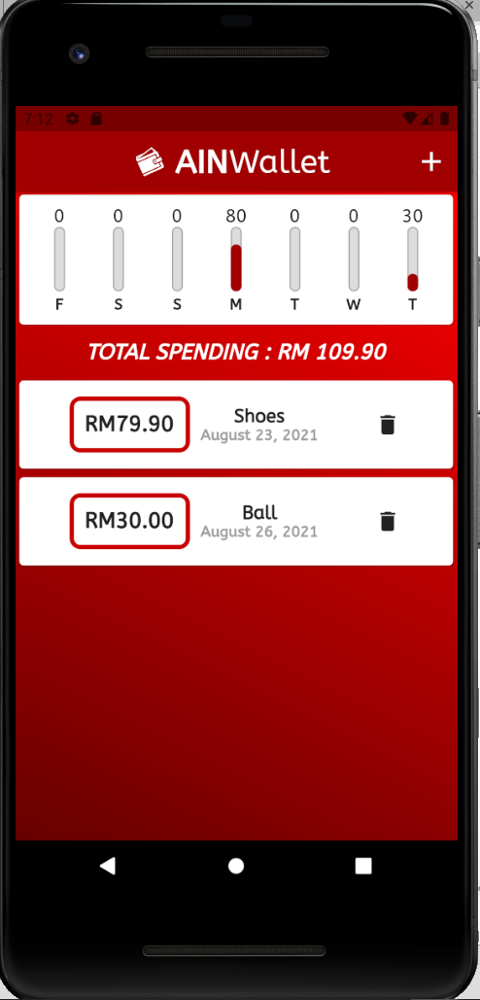

# AinWallet

My second app using Flutter. Designed for Pixel 2 device screen.

<h1>Homepage</h1>

 

<h1>Capablities</h1>

<h2>Add transactions with title, amount, date and unique ID</h2>

 

 

<h2>Complete error handling (Requires input to confirm)</h2>

 

<h2>Delete transactions</h2>

 

</h2>Shows chart that gives a rough estimate of your spending throughout the past 7 days</h2>

 
