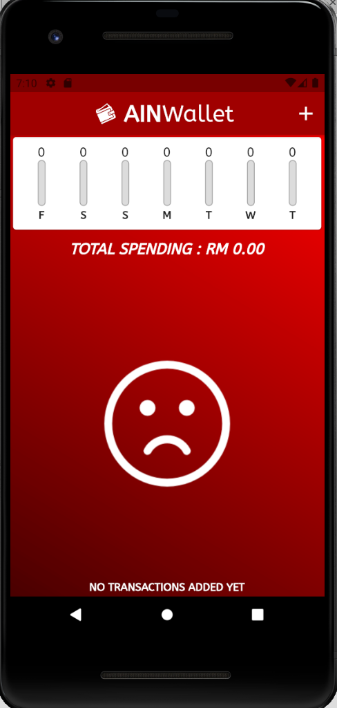
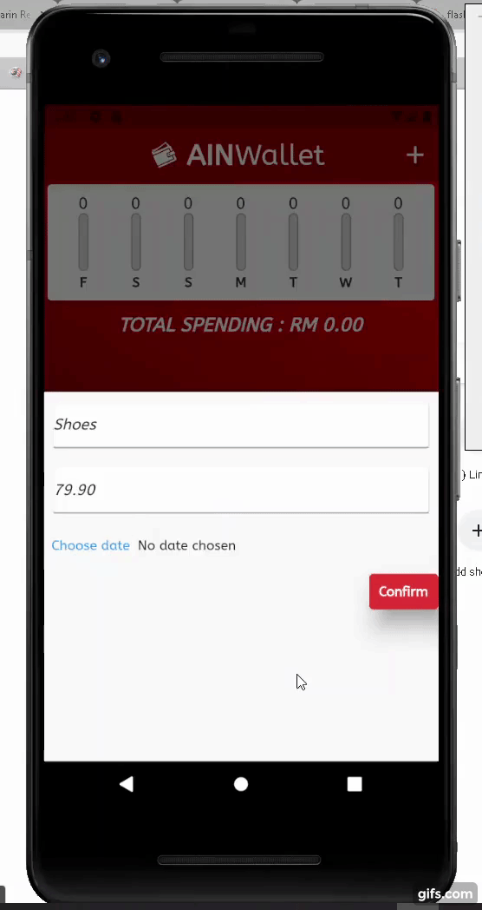
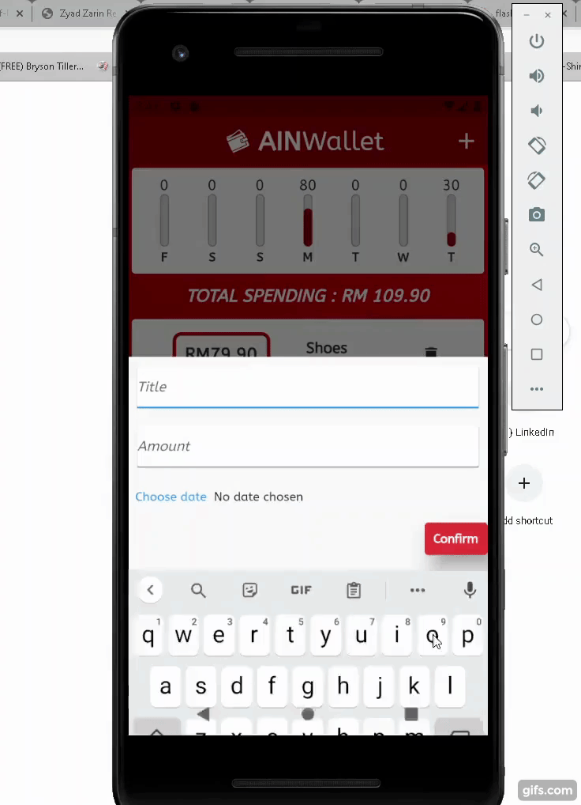

# ain_wallet

My second app using Flutter. Designed for Pixel 2 device screen.

Homepage :

 

Capabilities :

- Add transactions with title, amount, date and unique ID

 

 

- Complete error handling (Requires input to confirm)

 

- Delete transactions

 

- Shows chart that gives a rough estimate of your spending throughout the past 7 days

 

## Getting Started

This project is a starting point for a Flutter application.

A few resources to get you started if this is your first Flutter project:

- [Lab: Write your first Flutter app](https://flutter.dev/docs/get-started/codelab)
- [Cookbook: Useful Flutter samples](https://flutter.dev/docs/cookbook)

For help getting started with Flutter, view our
[online documentation](https://flutter.dev/docs), which offers tutorials,
samples, guidance on mobile development, and a full API reference.
