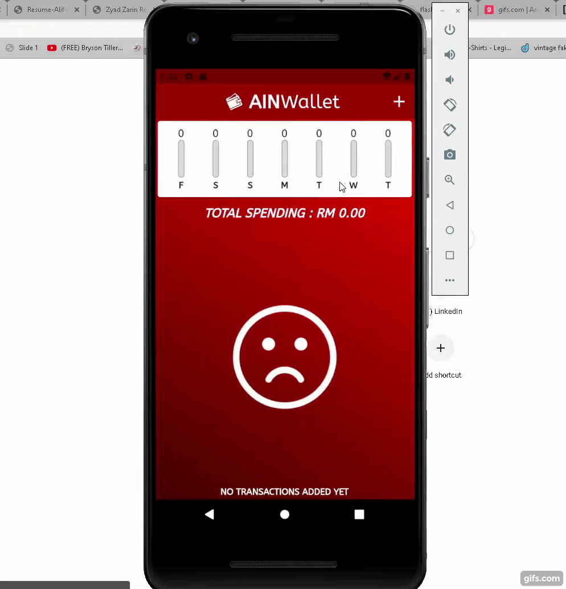

# AinWallet

My second app using Flutter. Designed for Pixel 2 device screen.

<h2>Homepage</h2>

 

<h2>Capablities</h2>

<h3>Add transactions with title, amount, date and unique ID</h3>

 

 

<h3>Complete error handling (Requires input to confirm)</h3>

 

<h3>Delete transactions</h3>

 

<h3>Shows chart that gives a rough estimate of your spending throughout the past 7 days</h3>

 
